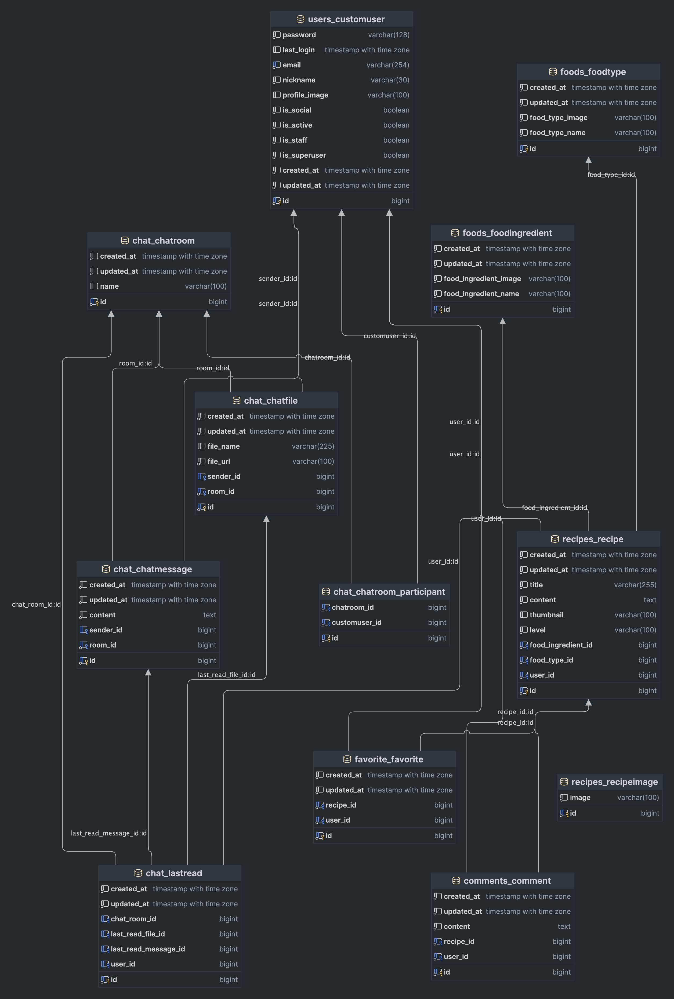

## 1. 📖 프로젝트 소개

> 🥘 자취인들을 위한 레시피 공유 커뮤니티 🥘

> 📌 자신만의 요리를 다른 사람과 공유해보세요!

## 2. 배포링크

### https://cookbap.netlify.app/

## 3. 프로젝트 기간

2024.05.02 ~ 2024.05.31

## 4. 서비스 소개

## 5. 팀원

### FE

| <a href=https://github.com/minhoshin11> <b>@minhoshin11</b></a>  | <a href=https://github.com/hyeonji1125> <b>@hyeonji1125</b></a>  | <a href=https://github.com/chaayee0123> <b>@chaayee0123</b></a>  | <a href=https://github.com/kshenk00> <b>@kshenk00</b></a>  |
| :---------------------------------------------------------------------------------------------------------------------------------------------------------------: | :---------------------------------------------------------------------------------------------------------------------------------------------------------------: | :---------------------------------------------------------------------------------------------------------------------------------------------------------------: | :---------------------------------------------------------------------------------------------------------------------------------------------------------: |
|                                                                              신민호                                                                               |                                                                              김현지                                                                               |                                                                              한채원                                                                               |                                                                           김보윤                                                                            |

### BE

| <a href=https://github.com/SwanyCastle> <b>@SwanyCastle</b></a>  | <a href=https://github.com/hjkim22> <b>@hjkim22</b></a>  | <a href=https://github.com/JMHman> <b>@JMHman</b></a>  |
| :--------------------------------------------------------------------------------------------------------------------------------------------------------------: | :-------------------------------------------------------------------------------------------------------------------------------------------------------: | :-----------------------------------------------------------------------------------------------------------------------------------------------------: |
|                                                                              곽승환                                                                              |                                                                          김형진                                                                           |                                                                         전명환                                                                          |

## 7. 사용스택

### System Architecture

### Front-End

### Back-End

### collaboration Tools

## 8. 프로젝트 규칙

### Branch Strategy

 

  

 

    Git-flow

<!--
> - main / dev 브랜치 기본 생성
> - main과 dev로 직접 push 제한
> - PR 전 최소 1인 이상 승인 필수
-->

### Git Commit Convention

> 1. 적절한 커밋 타입 작성
> 2. 커밋 메시지 내용 작성
> 3. (선택)내용 뒤에 이슈 (#이슈 번호)와 같이 작성하여 이슈 연결

> | 접두사     | 설명                           |
> | ---------- | ------------------------------ |
> | Feat :     | 새로운 기능 구현               |
> | Fix :      | 버그 수정                      |
> | Style :    | 코드 형식 스타일링 작업        |
> | Refactor : | 코드 리팩토링 (동작 변경 없음) |
> | Test :     | 테스트                         |
> | Chore :    | 기타 작업                      |
> | Remove :   | 파일 삭제                      |

### Pull Request

> ### Title
>
> - 제목은 '[브랜치명] 변경 내용 요약'과 같이 작성합니다.

> ### PR Type
>
> - [ ] FEAT: 새로운 기능 구현(Feature)
> - [ ] FIX: 버그 수정(Bugfix)
> - [ ] STYLE: 포맷팅 변경(Code style update)
> - [ ] REFACTOR: 코드 리팩토링(Refactoring, no functional changes, no api changes)
> - [ ] TEST: 테스트 관련(Test)
> - [ ] DEPLOY: 배포 관련(Deploy)
> - [ ] CONF: 빌드, 환경 설정(Build)
> - [ ] CHORE: 기타 작업(Other)

> ### Description
>
> - 구체적인 작업 내용을 작성해주세요.
> - 이미지를 별도로 첨부하면 더 좋습니다 👍

> ### Discussion
>
> - 추후 논의할 점에 대해 작성해주세요.

### Code Convention

#### FE

#### BE

### Communication Rules

- Discord 활용
- 정기회의

## 7. Documents

- [Flow Chart](https://www.figma.com/board/0NFyqEUfJ6MrqfafRyDNof/User-Flow-Chart?node-id=0-1&t=UIin6RlzQ3Um9lzf-0)
- [요구사항 정의서](https://docs.google.com/spreadsheets/d/1-O4TVb2A0cVXu-k68-3QdgQNGe0cIWnCkExpD80GpYA/edit?usp=sharing)
- [API 명세서](https://docs.google.com/spreadsheets/d/1Kp3m7kJn1nMAceiGLaUWFLHp8Ix9YEr3uknd9_eGTyE/edit?usp=sharing)
- [테이블 명세서](https://docs.google.com/spreadsheets/d/1hDm4pJYeJP3OmgDs6dzVS6gqp8yLvvxEu3jpG_nZMDA/edit?usp=sharing)
- [화면 정의서](https://docs.google.com/spreadsheets/d/1vBvqH6F2U6VuDyIFuDhcI5ZfzlXVKLmWBbOj8dJ_xAI/edit#gid=0)

<!-- ERD 해야함 -->

### ERD

